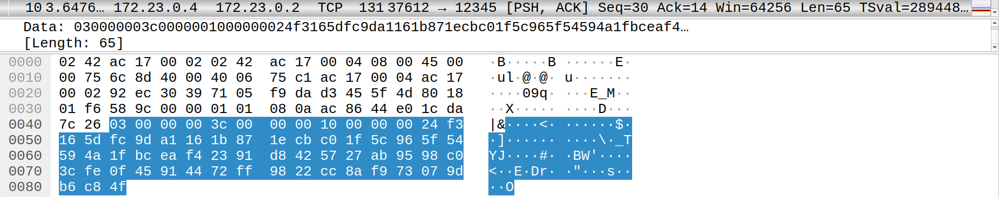

# PSI - projekt
Adam Czupryński, Michał Sadlej, Szymon Makuch

Szyfrowany protokół oparty na protokole TCP, tzw. mini TLS. Zaimplementowaliśmy wariant W2 (MAC-then-Encrypt) - w języku Python.

## Struktura
Struktury wiadomości składa się z następujących pól:

### ClientHello
- typ wiadomości
- długość wiadomości
- `g` - generator do algorytmu Diffie-Hellman
- `p` - liczba pierwsza do algorytmu Diffie-Hellman
- `A` - klucz publiczny klienta

### ServerHello
- typ wiadomości
- długość wiadomości
- `B` - klucz publiczny serwera

### Szyfrowana wiadomość
- typ wiadomości
- długość wiadomości
- `iv` - wektor inicjalizacyjny
- zaszyfrowana wiadomość
- MAC

### Szyfrowane EndSession
- typ wiadomości
- długość wiadomości
- powód zakończenia sesji

## Wykorzystane algorytmy 

### Wymiana kluczy
Zastosowaliśmy algorytm wymiany kluczy Diffie-Hellman. Przebieg wymiany:

1. Klient wybiera losową liczbę pierwszą `g` (generator) i liczbę pierwszą `p`
2. Klient generuje prywatny klucz `a`
3. Klient oblicza wartość publiczną: `A = (g^a) mod p`
4. Serwer generuje prywatny klucz `b`
5. Serwer oblicza wartość publiczną: `B = (g^b) mod p`
6. Obie strony wspólnie obliczają klucz symetryczny: `K = (B^a) mod p = (A^b) mod p`

### Szyfrowanie
Zastosowaliśmy prosty algorytm OTP (One-Time Pad):
- Każda wiadomość będzie szyfrowana przy użyciu jednorazowego klucza
- Klucz będzie generowany losowo dla każdej transmisji
- Szyfrowanie polega na operacji XOR między wiadomością a kluczem

Proces generowania klucza dla OTP:
- Initialization vector użyte jest jako pierszy blok
- W pętli generowane są kolejne bloki przy pomocy HMAC-SHA256 poprzez wyliczenie HMAC z poprzedniego bloku używając klucza sesji
- Po przekroczeniu zadanej długości pad jest przycinany do zadanej długości

### Scenariusz przykładowy

#### 1. Inicjacja połączenia i wymiana kluczy
1. Klient generuje liczbę pierwszą `p`, generator `g` i prywatny klucz `a` oraz oblicza `A = g^a mod p`
2. Klient wysyła ClientHello, w którym znajduje się `g`, `p` oraz `A`
3. Serwer generuje prywatny klucz `b` oraz oblicza `B = g^b mod p`
4. Serwer wysyła ServerHello, w którym znajduje się `B`
5. Obie strony obliczają wspólny klucz `K = A^b mod p = B^a mod p`

#### 2. Wysyłanie zaszyfrowanej wiadomości
1. Klient przygotowuje wiadomość `M`
2. Oblicza `MAC = HMAC(M, K)`
3. Łączy wiadomość z MAC: `data = M || MAC`
4. Generuje losowy `IV`
5. Szyfruje `data` używając `K` i `IV`: `encrypted = encrypt(data, K, IV)`
6. Wysyła EncryptedMessage, zawierającą `IV` i `encrypted`

#### 3. Odbieranie zaszyfrowanej wiadomości
1. Serwer odbiera EncryptedMessage
2. Deszyfruje dane używając `K` i `IV`: `decrypted = decrypt(encrypted_data, K, IV)`
3. Rozdziela odszyfrowane dane na wiadomość M i MAC
4. Oblicza własny `MAC' = HMAC(M, K)`
5. Porównuje `MAC'` z otrzymanym `MAC`
6. Jeśli `MAC' = MAC`, wiadomość jest poprawna

#### 4. Zakończenie sesji
Dowolna ze stron może zakończyć sesję wysyłając EndSession

## Realizacja mechanizmu integralności i autentyczności - MAC-then-Encrypt
Mechanizm MAC-then-encrypt ma prostszą implementację i mniejszą złożoność algorytmiczną niż Encrypt-then-MAC, jednocześnie zachowując mechanizmy integralności. Jednocześnie ma nieco niższy poziom bezpieczeństwa, a także wymaga pełnego odszyfrowania przed weryfikacją MAC.

### Przebieg procesu
1. Dla oryginalnej wiadomości generowany jest MAC przez hashowanie przy użyciu wspólnego klucza
2. Oryginalna wiadomość wraz z wygenerowanym MAC jest szyfrowana
3. Weryfikacja i deszyfrowanie po stronie odbiorcy:
   - Odszyfrowanie całej wiadomości (wiadomość + MAC)
   - Ponowne wygenerowanie MAC z odebranej wiadomości
   - Porównanie wygenerowanego MAC z odebranym

## Działanie programu

Przedstawione logi pokazują komunikację sieciową między serwerem a trzema klientami.

### Konfiguracja systemu
* Serwer nasłuchuje na porcie 12345
* Trzej klienci (client1, client2, client3) próbują się połączyć
* Używane są adresy IP w sieci 172.23.0.x
```bash
z34_server   | [2025-01-17 21:19:06,711] INFO: Server started on 0.0.0.0:12345
z34_client3  | Client server:12345 started
z34_client1  | Client server:12345 started
z34_client2  | Client server:12345 started
z34_client1  | Client> help
z34_client1  | Available commands:
z34_client1  |   connect - Connect to server
z34_client1  |   disconnect - Disconnect from server
z34_client1  |   send <message> - Send encrypted message
z34_client1  |   help - Show this help
z34_client1  |   exit - Exit client
z34_client1  | Server> list
z34_client1  | No connected clients
```

### Przebieg komunikacji
* Najpierw wszyscy klienci uruchamiają się
* Client1 łączy się jako pierwszy (z IP 172.23.0.5)
* Następnie łączy się client2 (IP 172.23.0.4)
* Na końcu łączy się client3 (IP 172.23.0.3)
* Każde połączenie inicjuje wymianę kluczy ("Key exchange completed")
```bash
z34_client1  | Client> help
z34_client1  | Available commands:
z34_client1  |   connect - Connect to server
z34_client1  |   disconnect - Disconnect from server
z34_client1  |   send <message> - Send encrypted message
z34_client1  |   help - Show this help
z34_client1  |   exit - Exit client
z34_client1  | Client> send test
z34_client1  | Not connected
z34_client1  | Client> connect
z34_client1  | [2025-01-17 21:21:08,806] INFO: Connected to server:12345
z34_server   | Server> [2025-01-17 21:21:08,806] INFO: New connection from ('172.21.0.5', 46904)
z34_server   | [2025-01-17 21:21:08,807] INFO: Key exchange completed with Client(('172.21.0.5', 46904))
z34_client1  | Client> [2025-01-17 21:21:08,807] INFO: Key exchange completed
z34_server   | list
z34_server   | 1. Client(('172.21.0.5', 46904))
z34_client2  | Client> connect
z34_server   | Server> [2025-01-17 21:21:17,485] INFO: New connection from ('172.21.0.4', 34398)
z34_server   | [2025-01-17 21:21:17,485] INFO: Key exchange completed with Client(('172.21.0.4', 34398))
z34_client2  | [2025-01-17 21:21:17,485] INFO: Connected to server:12345
z34_client2  | Client> [2025-01-17 21:21:17,485] INFO: Key exchange completed
z34_client3  | Client> connect
z34_server   | [2025-01-17 21:21:20,108] INFO: New connection from ('172.21.0.3', 49610)
z34_client3  | [2025-01-17 21:21:20,109] INFO: Connected to server:12345
z34_server   | [2025-01-17 21:21:20,109] INFO: Key exchange completed with Client(('172.21.0.3', 49610))
z34_client3  | Client> [2025-01-17 21:21:20,109] INFO: Key exchange completed
z34_server   | list
z34_server   | 1. Client(('172.21.0.5', 46904))
z34_server   | 2. Client(('172.21.0.4', 34398))
z34_server   | 3. Client(('172.21.0.3', 49610))
```

### Interakcje
* Klienci wysyłają testowe wiadomości
* Client1 rozłącza się samodzielnie
* Server odpina client2 komendą "disconnect"
* Server kończy działanie, co powoduje rozłączenie client3
```bash
z34_client1  | send test
z34_server   | Server> [2025-01-17 21:21:34,200] INFO: Message from Client(('172.21.0.5', 46904)): test
z34_client2  | send client2
z34_server   | [2025-01-17 21:21:39,398] INFO: Message from Client(('172.21.0.4', 34398)): client2
z34_client3  | send client3
z34_server   | [2025-01-17 21:21:42,508] INFO: Message from Client(('172.21.0.3', 49610)): client3
z34_client1  | Client> disconnect
z34_server   | [2025-01-17 21:21:45,405] INFO: Received EndSession from Client(('172.21.0.5', 46904)): Client initiated disconnect
z34_server   | [2025-01-17 21:21:45,406] INFO: Disconnecting Client(('172.21.0.5', 46904))
z34_client1  | [2025-01-17 21:21:45,406] ERROR: Connection closed by server
z34_client1  | [2025-01-17 21:21:45,406] WARNING: Not connected
z34_client1  | client receive loop ended
z34_client1  | [2025-01-17 21:21:45,406] INFO: Client disconnected
z34_server   | list       
z34_server   | 1. Client(('172.21.0.4', 34398))
z34_server   | 2. Client(('172.21.0.3', 49610))
z34_server   | Server> disconnect 1
z34_server   | [2025-01-17 21:21:55,572] INFO: Disconnecting Client(('172.21.0.4', 34398))
z34_client2  | Client> Received message: Server initiated disconnect
z34_client2  | [2025-01-17 21:21:56,427] ERROR: Connection closed by server
z34_client2  | [2025-01-17 21:21:56,428] INFO: Client disconnected
z34_client2  | client receive loop ended
z34_server   | Server> exit
z34_server   | [2025-01-17 21:22:28,495] INFO: Disconnecting Client(('172.21.0.3', 49610))
z34_client3  | Client> [2025-01-17 21:22:28,495] ERROR: Connection closed by server
z34_client3  | [2025-01-17 21:22:28,496] INFO: Client disconnected
z34_client3  | client receive loop ended
z34_server exited with code 0
```

### Wireshark
Poniższy zrzut ekranu pokazuje:
* Komunikację TCP między adresami 172.23.0.x
* Pakiety ARP służące do rozpoznawania adresów
* Wymianę pakietów SYN podczas nawiązywania połączeń
* Pakiety PSH+ACK przy przesyłaniu danych
* Różne długości pakietów wskazujące na szyfrowaną komunikację


Znając przyjętą przez nas strukturę wiadomości możemy zobaczyć co znajduje się w pakietach.
Struktura każdej wiadomości to: typ, długość, ładunek.


```
dane: 01000000180000000000000002000000000000000b0000000000000008
01000000 (1): typ wiadomości - ClientHello
1800000000000000 (24): długość
0200000000000000 (2): `g` - generator
0b00000000000000 (11): `p` - liczba pierwsza
08 (8): `A` - klucz publiczny klienta
```


```
dane: 02000000080000000000000003
02000000 (2): typ wiadomości - ServerHello
0800000000000000 (8): długość
03 (3): `B` - klucz publiczny serwera
```


```
dane: 030000003c0000001000000024f3165dfc9da1161b871ecbc01f5c965f54594a1fbceaf42391d8425727ab9598c03cfe0f45914472ff9822cc8af973079db6c84f
03000000 (3): typ wiadomości - EncryptedMessage
3c00000010000000 (60): długość
24f3165dfc9da1161b871ecbc01f5c965f54594a1fbceaf42391d8425727ab9598c03cfe0f45914472ff9822cc8af973079db6c84f - zaszyfrowana wiadomość
```


```
dane: 0400000053000000100000003b8bf4ce9189c396c7856cf62b5604f08af3535d5ddc7387e378b4862ca935395861cef2697feceeada1d05d6cb75cbf2d14b53b4b995d1ce5c6fd29c5a13d307a4bf15cd808dab5cb414779
04000000 (4): typ wiadomości - EndSession
5300000010000000 (83): długość
3b8bf4ce9189c396c7856cf62b5604f08af3535d5ddc7387e378b4862ca935395861cef2697feceeada1d05d6cb75cbf2d14b53b4b995d1ce5c6fd29c5a13d307a4bf15cd808dab5cb414779 - zaszyfrowany powód zakończenia sesji
```

### Odszyfrowywanie wiadomości

Skrypt `encryption_test.py` służy odszyfrowywaniu wiadomości w postaci ciągu szesnatkowego, znając klucz szyfrujący - zapisany podczas tworzenia klienta


Skrypt poprawnie odszyfrował ciąg `aafb8bef198c08b6c2a4420c90efd04757e4ab1fd3d49fcaacb87e1ae9b022f9707d172d49e1161f99e2e77cccc12bab723047dc` jako napis "test".

