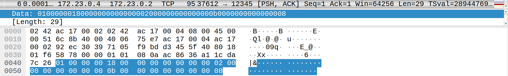
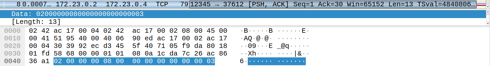
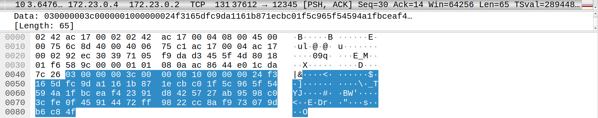
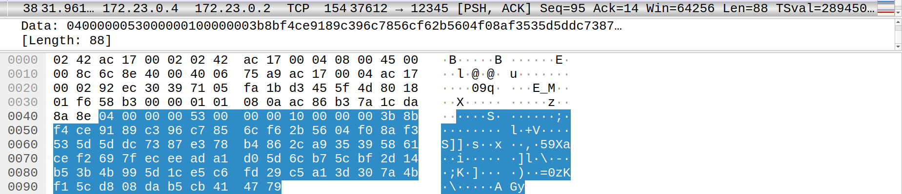
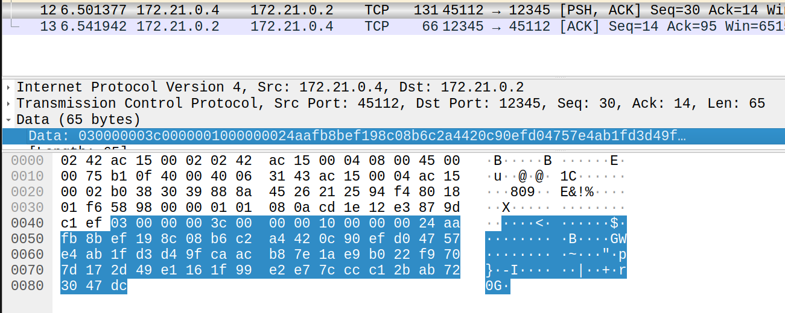

Znając przyjętą przez nas strukturę wiadomości możemy zobaczyć co znajduje się w pakietach
Struktura każdej wiadomości to: typ, długość, ładunek.

dane: 01000000180000000000000002000000000000000b0000000000000008
01000000 (1): typ wiadomości - ClientHello
1800000000000000 (24): długość
0200000000000000 (2): `g` - generator
0b00000000000000 (11): `p` - liczba pierwsza
08 (8): `A` - klucz publiczny klienta

dane: 02000000080000000000000003
02000000 (2): typ wiadomości - ServerHello
0800000000000000 (8): długość
03 (3): `B` - klucz publiczny serwera

dane: 030000003c0000001000000024f3165dfc9da1161b871ecbc01f5c965f54594a1fbceaf42391d8425727ab9598c03cfe0f45914472ff9822cc8af973079db6c84f
03000000 (3): typ wiadomości - EncryptedMessage
3c00000010000000 (60): długość
24f3165dfc9da1161b871ecbc01f5c965f54594a1fbceaf42391d8425727ab9598c03cfe0f45914472ff9822cc8af973079db6c84f - zaszyfrowana wiadomość

dane: 0400000053000000100000003b8bf4ce9189c396c7856cf62b5604f08af3535d5ddc7387e378b4862ca935395861cef2697feceeada1d05d6cb75cbf2d14b53b4b995d1ce5c6fd29c5a13d307a4bf15cd808dab5cb414779
04000000 (4): typ wiadomości - EndSession
5300000010000000 (83): długość
3b8bf4ce9189c396c7856cf62b5604f08af3535d5ddc7387e378b4862ca935395861cef2697feceeada1d05d6cb75cbf2d14b53b4b995d1ce5c6fd29c5a13d307a4bf15cd808dab5cb414779 - zaszyfrowany powód zakończenia sesji

odszyfrowywanie ręczne:

