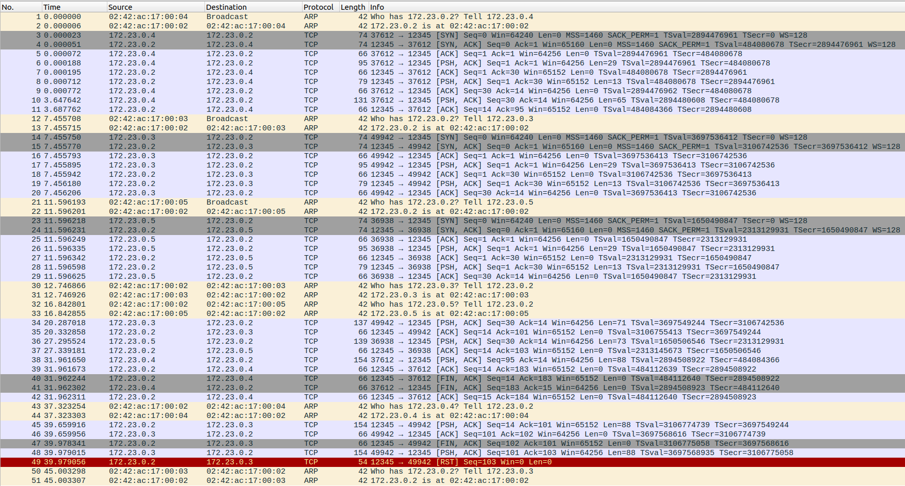

Zrzut z działania systemu:

```bash
z34_server   | [2025-01-17 21:19:06,711] INFO: Server started on 0.0.0.0:12345
z34_client3  | Client server:12345 started
z34_client1  | Client server:12345 started
z34_client2  | Client server:12345 started
z34_client1  | Client> help
z34_client1  | Available commands:
z34_client1  |   connect - Connect to server
z34_client1  |   disconnect - Disconnect from server
z34_client1  |   send <message> - Send encrypted message
z34_client1  |   help - Show this help
z34_client1  |   exit - Exit client
z34_client1  | Client> send test
z34_client1  | Not connected
z34_client1  | Client> connect
z34_client1  | [2025-01-17 21:21:08,806] INFO: Connected to server:12345
z34_server   | Server> [2025-01-17 21:21:08,806] INFO: New connection from ('172.21.0.5', 46904)
z34_server   | [2025-01-17 21:21:08,807] INFO: Key exchange completed with Client(('172.21.0.5', 46904))
z34_client1  | Client> [2025-01-17 21:21:08,807] INFO: Key exchange completed
z34_server   | list
z34_server   | 1. Client(('172.21.0.5', 46904))
z34_client2  | Client> connect
z34_server   | Server> [2025-01-17 21:21:17,485] INFO: New connection from ('172.21.0.4', 34398)
z34_server   | [2025-01-17 21:21:17,485] INFO: Key exchange completed with Client(('172.21.0.4', 34398))
z34_client2  | [2025-01-17 21:21:17,485] INFO: Connected to server:12345
z34_client2  | Client> [2025-01-17 21:21:17,485] INFO: Key exchange completed
z34_client3  | Client> connect
z34_server   | [2025-01-17 21:21:20,108] INFO: New connection from ('172.21.0.3', 49610)
z34_client3  | [2025-01-17 21:21:20,109] INFO: Connected to server:12345
z34_server   | [2025-01-17 21:21:20,109] INFO: Key exchange completed with Client(('172.21.0.3', 49610))
z34_client3  | Client> [2025-01-17 21:21:20,109] INFO: Key exchange completed
z34_server   | list
z34_server   | 1. Client(('172.21.0.5', 46904))
z34_server   | 2. Client(('172.21.0.4', 34398))
z34_server   | 3. Client(('172.21.0.3', 49610))
z34_client1  | send test
z34_server   | Server> [2025-01-17 21:21:34,200] INFO: Message from Client(('172.21.0.5', 46904)): test
z34_client2  | send client2
z34_server   | [2025-01-17 21:21:39,398] INFO: Message from Client(('172.21.0.4', 34398)): client2
z34_client3  | send client3
z34_server   | [2025-01-17 21:21:42,508] INFO: Message from Client(('172.21.0.3', 49610)): client3
z34_client1  | Client> disconnect
z34_server   | [2025-01-17 21:21:45,405] INFO: Received EndSession from Client(('172.21.0.5', 46904)): Client initiated disconnect
z34_server   | [2025-01-17 21:21:45,406] INFO: Disconnecting Client(('172.21.0.5', 46904))
z34_client1  | [2025-01-17 21:21:45,406] ERROR: Connection closed by server
z34_client1  | [2025-01-17 21:21:45,406] WARNING: Not connected
z34_client1  | client receive loop ended
z34_client1  | [2025-01-17 21:21:45,406] INFO: Client disconnected
z34_server   | list       
z34_server   | 1. Client(('172.21.0.4', 34398))
z34_server   | 2. Client(('172.21.0.3', 49610))
z34_server   | Server> disconnect 1
z34_server   | [2025-01-17 21:21:55,572] INFO: Disconnecting Client(('172.21.0.4', 34398))
z34_client2  | Client> Received message: Server initiated disconnect
z34_client2  | [2025-01-17 21:21:56,427] ERROR: Connection closed by server
z34_client2  | [2025-01-17 21:21:56,428] INFO: Client disconnected
z34_client2  | client receive loop ended
z34_server   | Server> exit
z34_server   | [2025-01-17 21:22:28,495] INFO: Disconnecting Client(('172.21.0.3', 49610))
z34_client3  | Client> [2025-01-17 21:22:28,495] ERROR: Connection closed by server
z34_client3  | [2025-01-17 21:22:28,496] INFO: Client disconnected
z34_client3  | client receive loop ended
z34_server exited with code 0
```



