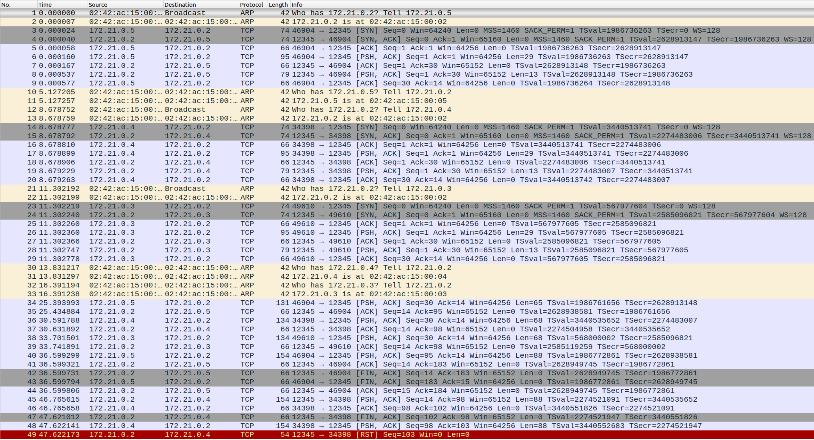

Zrzut z działania systemu:

```bash
server-1   | [2025-01-17 19:53:16,312] INFO: Server started on 0.0.0.0:12345
client2-1  | Client server:12345 started
client3-1  | Client server:12345 started
client1-1  | Client server:12345 started
server-1   | Server> help
server-1   | Available commands:
server-1   |   list - List connected clients
server-1   |   disconnect <client_number> - Disconnect a client
server-1   |   help - Show this help
server-1   |   exit - Stop the server
server-1   | Server> list
server-1   | No connected clients
client1-1  | Client> help
client1-1  | Available commands:
client1-1  |   connect - Connect to server
client1-1  |   disconnect - Disconnect from server
client1-1  |   send <message> - Send encrypted message
client1-1  |   help - Show this help
client1-1  |   exit - Exit client
client1-1  | Client> send test
client1-1  | Not connected
client1-1  | Client> connect
server-1   | Server> [2025-01-17 19:54:35,675] INFO: New connection from ('172.23.0.4', 37612)
client1-1  | [2025-01-17 19:54:35,675] INFO: Connected to server:12345
client1-1  | Client> [2025-01-17 19:54:35,675] INFO: Key exchange completed
server-1   | [2025-01-17 19:54:35,675] INFO: Key exchange completed with Client(('172.23.0.4', 37612))
client1-1  | send test
server-1   | [2025-01-17 19:54:39,322] INFO: Message from Client(('172.23.0.4', 37612)): test
client2-1  | Client> connect
server-1   | [2025-01-17 19:54:43,130] INFO: New connection from ('172.23.0.3', 49942)
server-1   | [2025-01-17 19:54:43,131] INFO: Key exchange completed with Client(('172.23.0.3', 49942))
client2-1  | [2025-01-17 19:54:43,131] INFO: Key exchange completed
client2-1  | [2025-01-17 19:54:43,131] INFO: Connected to server:12345
client3-1  | Client> connect
server-1   | [2025-01-17 19:54:47,271] INFO: New connection from ('172.23.0.5', 36938)
server-1   | [2025-01-17 19:54:47,271] INFO: Key exchange completed with Client(('172.23.0.5', 36938))
client3-1  | [2025-01-17 19:54:47,271] INFO: Connected to server:12345
client3-1  | Client> [2025-01-17 19:54:47,271] INFO: Key exchange completed
server-1   | list
server-1   | 1. Client(('172.23.0.4', 37612))
server-1   | 2. Client(('172.23.0.3', 49942))
server-1   | 3. Client(('172.23.0.5', 36938))
client2-1  | Client> send client two
server-1   | Server> [2025-01-17 19:54:55,962] INFO: Message from Client(('172.23.0.3', 49942)): client two
client3-1  | send client three
server-1   | [2025-01-17 19:55:02,970] INFO: Message from Client(('172.23.0.5', 36938)): client three
client1-1  | Client> disconnect
server-1   | [2025-01-17 19:55:07,636] INFO: Received EndSession from Client(('172.23.0.4', 37612)): Client initiated disconnect
server-1   | [2025-01-17 19:55:07,637] INFO: Disconnecting Client(('172.23.0.4', 37612))
client1-1  | [2025-01-17 19:55:07,637] ERROR: Connection closed by server
client1-1  | [2025-01-17 19:55:07,637] WARNING: Not connected
client1-1  | client receive loop ended
client1-1  | [2025-01-17 19:55:07,637] INFO: Client disconnected
server-1   | list
server-1   | 1. Client(('172.23.0.3', 49942))
server-1   | 2. Client(('172.23.0.5', 36938))
server-1   | Server> disconnect 1
server-1   | [2025-01-17 19:55:15,334] INFO: Disconnecting Client(('172.23.0.3', 49942))
client2-1  | Client> Received message: Server initiated disconnect
client2-1  | [2025-01-17 19:55:15,653] ERROR: Connection closed by server
client2-1  | [2025-01-17 19:55:15,654] INFO: Client disconnected
client2-1  | client receive loop ended
server-1   | Server> exit
server-1   | [2025-01-17 19:56:14,771] INFO: Disconnecting Client(('172.23.0.5', 36938))
client3-1  | Client> [2025-01-17 19:56:14,771] ERROR: Connection closed by server
client3-1  | [2025-01-17 19:56:14,772] INFO: Client disconnected
client3-1  | client receive loop ended
server-1 exited with code 0
```



